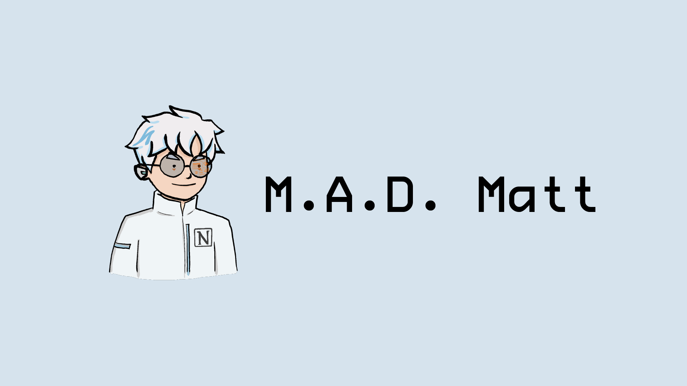

# Mad Matt AI



A chatbot version of myself, with all of my Notion knowledge.

Feel free to check out this link to start chatting with Mad Matt[https://mad-matt-ai.vercel.app/](https://mad-matt-ai.vercel.app/)

## Table of Contents

- [Description](#description)
- [Features](#features)
- [Technologies](#technologies)
- [Installation](#installation)
- [Usage](#usage)
- [Contributing](#contributing)
- [License](#license)
- [Contact](#contact)

## Description

Mad Matt AI is a chatbot that aims to replicate Matt's knowledge and personality by leveraging his Notion data. This project integrates OpenAI, Typescript, LangChain, and Pinecone to create a unique and engaging chat experience.

## Features

- Interactive chatbot with a natural language understanding
- Integration with Notion to access my own Notion knowledge

## Technologies

- [OpenAI](https://openai.com/): A powerful AI language model
- [LangChain](https://github.com/hwchase17/langchainjs): Building applications with LLMs through composability
- [Pinecone](https://www.pinecone.io/): A vector database for vector search

## Installation

Follow these steps to set up the Mad Matt AI on your local machine:

1. Clone the repository:

```bash
git clone https://github.com/mattchw/mad-matt-ai.git
```

2. Install the required dependencies:

```bash
cd mad-matt-ai
pnpm install
```

3. Create a `.env` file in the root directory and add the necessary API keys and credentials for OpenAI and Pinecone.

```
OPENAI_API_KEY=your_open_api_key
PINECONE_API_KEY=your_pinecone_api_key
PINECONE_ENVIRONMENT=your_pinecone_environment
```

4. Compile and run the project:

```bash
pnpm run dev
```

## Usage

To start using Mad Matt AI, open your favorite web browser and navigate to `http://localhost:3000`. Interact with the chatbot by typing your questions or statements in the input field and pressing "Enter" or clicking the "Send" button.

## Contributing

Contributions are welcome! If you'd like to contribute, please fork the repository and make changes as you'd like. Pull requests are warmly welcomed.

## License

This project is licensed under the [MIT License](LICENSE).

## Contact

If you have any questions or suggestions, feel free to open an issue or submit a pull request. You can also reach out to me at [matthew.chohin@gmail.com](mailto:matthew.chohin@gmail.com).
